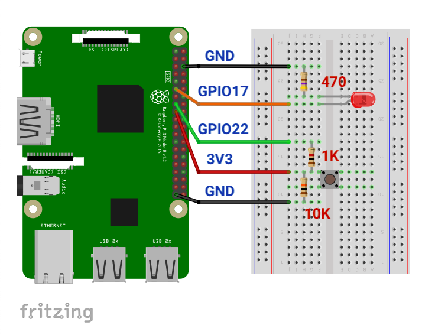

# LINE Things with Raspberry Pi

These are the codes for LINE Things Developer Trial to use with Raspberry Pi using Node.js.

## Getting Started
1. Wire the Pi's GPIO like this image.

2. Clone this repository.
3. Install Node.js version 8.x, open terminal and run this code
    > If you have higher version please downgrade to 8.x or Bleno might fail to install.
    ```
    curl -sL https://deb.nodesource.com/setup_8.x | sudo -E bash -
    sudo apt-get install -y nodejs
    ```
3. Install this code in terminal.

    ```
    sudo apt-get install bluetooth bluez libbluetooth-dev libudev-dev
    ```

4. Run `npm install` to install all requirements.
5. Run `sudo npm start` to start bluetooth service.
    > If you want to see what happenning under the hood, run `sudo npm run debug`.
6. Scan the following QR code with LINE to activate LINE Things.

    

    Upon turning the device on, a device with the name `LINE Things Starter (Default Firmware)`  will be detected.

    Once the device is connected, the LIFF app can then be launched by selecting the device.

7. Now you can with LED and Button. Control LED over the LIFF app or push button on board and see what happen on LIFF app.

    